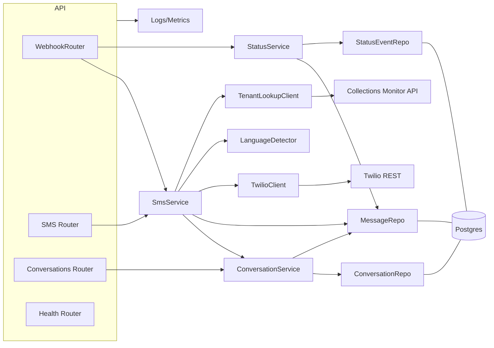

# SMS Foundation Agent Architecture Document

## Introduction

This document outlines the overall project architecture for SMS Foundation Agent, focusing on backend systems and non‑UI concerns. It is the guiding blueprint for AI‑driven development, ensuring consistency with the PRD and adherence to chosen patterns and technologies.

Starter Template or Existing Project: N/A – Greenfield project. Starting from scratch aligns the implementation tightly to PRD NFRs (idempotency, observability, durability) without legacy constraints. A cookiecutter FastAPI template may be considered later to accelerate scaffolding.

## High Level Architecture

### Technical Summary
A containerized, async FastAPI microservice handles all SMS workflows: Twilio inbound webhooks, outbound sends, and delivery status callbacks. It persists full‑fidelity webhook payloads and normalized domain records in Supabase Postgres with strict idempotency on Twilio MessageSid. A layered design (API → service → repository) enables clean separation of concerns; background tasks keep webhook responses fast and offload tenant lookup via the Collections Monitor and language detection heuristics. Observability (structured logs/metrics) and health checks cover DB, Twilio, and monitor connectivity to meet reliability and auditability goals in the PRD.

### High Level Overview
1. Architectural style: Containerized monolithic service with async I/O; background tasks for non‑critical work.
2. Repository structure: Single‑service repo (polyrepo); can join a platform monorepo later.
3. Service architecture: API layer (FastAPI routers) → Application services (orchestrate, idempotency, retries) → Repositories (SQLAlchemy async) → Integrations (Twilio, Collections Monitor).
4. Primary flows:
   - Inbound: Twilio → verify signature → normalize phone → upsert conversation → insert message with raw JSON → enqueue tenant lookup/lang detect → 200 OK.
   - Outbound: Request → create message row (pending) → Twilio REST send → update status; later status webhook finalizes lifecycle.
   - Status: Twilio callback → verify → update delivery state idempotently.
5. Key decisions: E.164 normalization via phonenumbers; unique constraint on twilio_sid; JSONB raw payload for audit; EN/ES/PT heuristics; consistent error model.

### High Level Project Diagram
```mermaid
graph LR
  Twilio[Twilio SMS/Webhooks] -->|/webhook/twilio/sms| API[FastAPI Routers]
  Twilio -->|/webhook/twilio/status| API
  API --> SVC[Service Layer (Idempotency, Orchestration)]
  SVC --> BG[Background Tasks]
  SVC --> DB[(Supabase Postgres)]
  BG --> MON[Collections Monitor API]
  SVC --> TWAPI[Twilio REST API]
  SVC --> LOG[Structured Logs & Metrics]
  MON -.tenant match .-> DB
  TWAPI -.send/update.-> Twilio
```

## Infrastructure and Deployment

### Infrastructure as Code
- Tool: Terraform 1.7.x
- Location: `infrastructure/terraform`
- Approach: Module-per-environment; Cloud Run service + secret bindings; output service URL for Twilio webhooks.

### Deployment Strategy
- Strategy: Build container → push to registry → deploy to Cloud Run with min instances=1 (reduce cold starts).
- CI/CD Platform: GitHub Actions
- Pipeline Configuration: `.github/workflows/deploy.yaml` (build, test, push, deploy; env-specific variables)

### Environments
- Development: Dev testing and integration with Twilio dev number; permissive CORS; verbose logging.
- Staging: Pre-prod tests with real callbacks; load tests; masked logs.
- Production: Hardened config; IP allowlist or WAF on webhook if feasible; min instances scaled per traffic.

### Promotion Flow
PR → CI tests → merge to main → deploy to staging → automated smoke → manual approval → deploy to prod.

### Rollback Strategy
- Primary Method: Cloud Run revision rollback (pin to previous image); retain N previous images.
- Triggers: Elevated error rates, failed smoke tests, alert thresholds.
- RTO: < 15 minutes.

## Error Handling Strategy

### General Approach
- Error Model: Consistent ApiError envelope for client responses; internal exceptions mapped at the edge.
- Exception Hierarchy: Custom domain exceptions (IdempotencyError, ValidationError, ExternalServiceError, NotFoundError).
- Error Propagation: Raise domain exceptions in services; translate in a global FastAPI exception handler; never leak stack traces.

### Logging Standards
- Library: structlog (JSON)
- Format: JSON fields: timestamp, level, msg, request_id, twilio_sid, phone, route, tenant_id (when available).
- Levels: DEBUG (dev only), INFO (normal ops), WARN (transients), ERROR (failures).
- Required Context: Correlation ID (request_id), service context (service="sms-foundation"), user context only when authenticated (mostly N/A).

### Error Handling Patterns
#### External API Errors
- Retry Policy: Exponential backoff with jitter (100ms→2s, 3–5 attempts) for 5xx/timeouts.
- Circuit Breaker: Optional later; start with metrics-based alerting.
- Timeouts: httpx client timeouts (connect/read 3s); fail fast in webhook, continue via background tasks.
- Error Translation: Map Twilio/monitor errors to ExternalServiceError with limited details.

#### Business Logic Errors
- Custom Exceptions: ValidationError for bad input; IdempotencyError for duplicate SIDs; NotFoundError for missing conversation.
- User-Facing Errors: ApiError { error: { code, message, details?, timestamp, requestId } }.
- Error Codes: sms.validation_error, sms.idempotent_duplicate, sms.external_failed, sms.not_found.

#### Data Consistency
- Transaction Strategy: SQLAlchemy async session with transactions per request; repository methods are atomic.
- Compensation: On outbound send failure, mark message failed and persist error; no partial deletes.
- Idempotency: Unique constraint on twilio_sid; status callbacks idempotently upsert last-known state and append events.

## Coding Standards

### Core Standards
- Languages & Runtimes: Python 3.11.x; FastAPI; SQLAlchemy 2.x async; Alembic; httpx; twilio.
- Style & Linting: ruff + black + isort; mypy strict on src; JSON logs via structlog.
- Test Organization: pytest with `tests/unit`, `tests/integration`; async tests use `pytest-asyncio`; external HTTP via respx.

### Critical Rules
- Type Sharing: Define DTOs and response models with Pydantic; never return raw dicts from routers.
- Repository Pattern: All DB access through repositories; no inline SQL in routers/services.
- Idempotency: All webhook handlers must guard via unique `twilio_sid`; duplicates return 200 OK no-op.
- Validation: Validate inputs at API boundary; normalize phone numbers with `phonenumbers` before use.
- Logging: Use structlog with request_id and twilio_sid; never log secrets or full PII payloads.
- Background Work: Long-running/external calls use BackgroundTasks; webhook responds fast.
- Errors: Translate internal exceptions to ApiError; do not leak stack traces.
- Config: Centralized settings module; avoid scattered `os.environ` access.

## Tech Stack

### Cloud Infrastructure (Recommendation)
- Platform: Google Cloud Run + Supabase Postgres
  - Pros: Simple container deploys, autoscaling, HTTPS; easy Twilio webhook hosting
  - Cons: GCP‑specific; cold starts (mitigable)

### Technology Stack Table
| Category              | Technology                         | Version | Purpose                            | Rationale |
|-----------------------|------------------------------------|---------|------------------------------------|-----------|
| Language              | Python                             | 3.11.x  | Service implementation             | Stable async + lib compatibility |
| Framework             | FastAPI                            | 0.x     | REST API, OpenAPI                  | Async, typing, great DX |
| ASGI Server           | Uvicorn + uvloop                   | 0.x     | Production ASGI                    | Performance |
| Models/Validation     | Pydantic                           | 2.x     | Request/response schemas           | Perf + typing |
| ORM/DB                | SQLAlchemy (async) + Alembic       | 2.x/1.x | Data access + migrations           | Mature ecosystem |
| PG Driver             | asyncpg                            | 0.x     | Async Postgres driver              | Performance with SQLA 2.x |
| HTTP Client           | httpx                              | 0.x     | External calls                     | Async, testable |
| Twilio SDK            | twilio                             | 8.x     | Sends + signature verify           | Official SDK |
| Phone Parsing         | phonenumbers                       | 8.x     | E.164 normalization                | Proven lib |
| Background Tasks      | FastAPI BackgroundTasks            | builtin | Offload non‑critical work          | Meets NFRs initially |
| Testing               | pytest, pytest‑asyncio, respx, testcontainers‑postgres | pinned  | Unit/integration                    | Async + external stubs |
| Lint/Format/Type      | ruff, black, isort, mypy           | pinned  | Code quality                       | Fast + consistent |
| Observability         | structlog (JSON), prometheus‑client, opentelemetry (opt) | pinned | Logs/metrics/traces                 | Meets NFRs |
| Container             | Docker (multi‑stage)               | 24.x    | Build/runtime                      | Small secure image |
| CI/CD                 | GitHub Actions                     | n/a     | CI, tests, build, deploy           | Common, simple |
| IaC                   | Terraform                          | 1.7.x   | Infra as code (later)              | Standardize envs |
| API Style             | REST + OpenAPI 3                   | n/a     | External integration               | Simplicity + tooling |

## Data Models

### sms_conversations
- Purpose: Track a conversation per phone number; hold workflow context, tenant link, language, and last activity.
- Key Attributes:
  - id (uuid, pk)
  - phone_number_canonical (text, E.164, unique)
  - phone_number_original (text)
  - tenant_id (uuid, nullable)
  - workflow_type (text, nullable), workflow_id (text, nullable)
  - language_detected (text: en|es|pt|unknown), language_confidence (numeric)
  - last_message_at (timestamptz), created_at, updated_at
- Relationships:
  - 1..N → sms_messages (by conversation_id)

### sms_messages
- Purpose: Persist inbound/outbound messages with dedupe on Twilio SID and full raw payload for audit.
- Key Attributes:
  - id (uuid, pk), conversation_id (uuid fk → sms_conversations)
  - direction (text: inbound|outbound)
  - twilio_sid (text, unique)
  - from_number (text), to_number (text)
  - message_content (text)
  - delivery_status (text: queued|sending|sent|delivered|undelivered|failed|receiving|received|unknown)
  - raw_webhook_data (jsonb)
  - created_at, updated_at
- Relationships:
  - 1..N → sms_message_status_events

### sms_message_status_events
- Purpose: Keep delivery status history and callback payloads for lifecycle traceability.
- Key Attributes:
  - id (uuid, pk), message_id (uuid fk → sms_messages)
  - event_status (text), error_code (text, nullable)
  - raw_webhook_data (jsonb)
  - created_at

## Components

### WebhookRouter
- Responsibility: Handle POST `/webhook/twilio/sms` and `/webhook/twilio/status`; verify Twilio signature; parse payload; return 200 quickly.
- Key Interfaces: TwilioAuthVerifier; SmsService; StatusService.
- Dependencies: FastAPI, Twilio SDK (signature verify), config.

### SmsService
- Responsibility: Orchestrate inbound/outbound flows; idempotency by `twilio_sid`; E.164 normalization; upsert conversation; persist message; schedule background tasks (tenant lookup, language detect).
- Key Interfaces: ConversationRepo; MessageRepo; TwilioClient; TenantLookupClient; LanguageDetector.
- Dependencies: SQLAlchemy async; phonenumbers; BackgroundTasks.

### ConversationService
- Responsibility: Manage conversations (create/update, last_message_at, language fields); fetch by number; list messages.
- Key Interfaces: ConversationRepo; MessageRepo.
- Dependencies: DB session; phone normalization utility.

### StatusService
- Responsibility: Process Twilio status callbacks; map statuses; update message + append status events idempotently.
- Key Interfaces: MessageRepo; StatusEventRepo.
- Dependencies: Twilio signature verify; status mapping.

### TenantLookupClient
- Responsibility: Call Collections Monitor with variants (raw, E.164, digits‑only, country‑stripped); retry/backoff; update conversation. 
- Key Interfaces: httpx; ConversationService.
- Dependencies: `MONITOR_API_URL`; auth if required.

### LanguageDetector
- Responsibility: Heuristic EN/ES/PT detection per message; compute confidence; update conversation.
- Key Interfaces: ConversationService.
- Dependencies: simple rules; extensible later.

### TwilioClient
- Responsibility: Send outbound via Twilio REST; return SID; map errors; sign/verify helpers.
- Key Interfaces: twilio SDK; SmsService.
- Dependencies: TWILIO_ACCOUNT_SID; TWILIO_AUTH_TOKEN; TWILIO_PHONE_NUMBER.

### Repository Layer
- Responsibility: Data access via SQLAlchemy Async: ConversationRepo, MessageRepo, StatusEventRepo.
- Key Interfaces: DB session; models; migrations.
- Dependencies: asyncpg; Alembic.

### Observability & Health
- Responsibility: Structured logging; metrics; `/health` checks DB, Twilio, monitor.
- Key Interfaces: structlog; prometheus‑client; health service.
- Dependencies: config; httpx; DB session.


