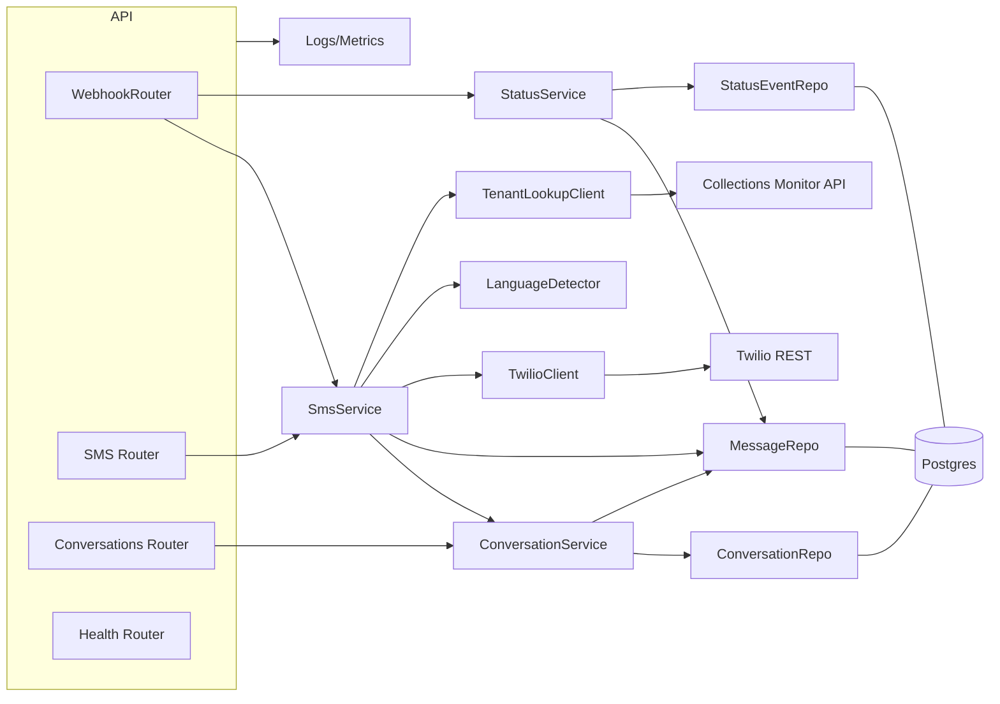

# Components

## WebhookRouter
- Responsibility: Handle POST `/webhook/twilio/sms` and `/webhook/twilio/status`; verify Twilio signature; parse payload; return 200 quickly.
- Key Interfaces: TwilioAuthVerifier; SmsService; StatusService.
- Dependencies: FastAPI, Twilio SDK (signature verify), config.

## SmsService
- Responsibility: Orchestrate inbound/outbound flows; idempotency by `twilio_sid`; E.164 normalization; upsert conversation; persist message; schedule background tasks (tenant lookup, language detect).
- Key Interfaces: ConversationRepo; MessageRepo; TwilioClient; TenantLookupClient; LanguageDetector.
- Dependencies: SQLAlchemy async; phonenumbers; BackgroundTasks.

## ConversationService
- Responsibility: Manage conversations (create/update, last_message_at, language fields); fetch by number; list messages.
- Key Interfaces: ConversationRepo; MessageRepo.
- Dependencies: DB session; phone normalization utility.

## StatusService
- Responsibility: Process Twilio status callbacks; map statuses; update message + append status events idempotently.
- Key Interfaces: MessageRepo; StatusEventRepo.
- Dependencies: Twilio signature verify; status mapping.

## TenantLookupClient
- Responsibility: Call Collections Monitor with variants (raw, E.164, digits‑only, country‑stripped); retry/backoff; update conversation. 
- Key Interfaces: httpx; ConversationService.
- Dependencies: `MONITOR_API_URL`; auth if required.

## LanguageDetector
- Responsibility: Heuristic EN/ES/PT detection per message; compute confidence; update conversation.
- Key Interfaces: ConversationService.
- Dependencies: simple rules; extensible later.

## TwilioClient
- Responsibility: Send outbound via Twilio REST; return SID; map errors; sign/verify helpers.
- Key Interfaces: twilio SDK; SmsService.
- Dependencies: TWILIO_ACCOUNT_SID; TWILIO_AUTH_TOKEN; TWILIO_PHONE_NUMBER.

## Repository Layer
- Responsibility: Data access via SQLAlchemy Async: ConversationRepo, MessageRepo, StatusEventRepo.
- Key Interfaces: DB session; models; migrations.
- Dependencies: asyncpg; Alembic.

## Observability & Health
- Responsibility: Structured logging; metrics; `/health` checks DB, Twilio, monitor.
- Key Interfaces: structlog; prometheus‑client; health service.
- Dependencies: config; httpx; DB session.

